Final Project - Wine Quality Reds


Welcome
Exploration of the Wine data set focusing on Reds.

---

Notes on wine production:

The quality of grape vines and the soil play a huge part in wine quality. The "terroir," is how a region's climate and soils affect the taste of wine.

Wine production goes through a series of steps that include:
Harvest of the grapes
Transportation/Cooling/Handling
De-Stemming/Crushing
Additions/Adjustments (Sulfurdioxide, Sugar, Acids)

These adjustments can impact the fine quality of the wine.
Fermentation using yeast with the skins on
Draining/Pressing
Malo-lactic fermentation.
Then racking/clarification and storage. Possible blending with other wines.
Clarification/Fining.
Cold stabilization.

The timing and picking of the grapes greatly affects the quality of the wine.

The taste and 'mouth-feel' sensations are due to the included compounds - ethanol, acids(malic, lactic, and tartaric), sugars, and glycerol.

How a wine is stored can also impact its quality. Oak barrels impart various compounds and flavors to the wine, while stainless steel does not.

---

```Load libraries

```{r load needed libraries}
library(dplyr)
library(ggplot2)
library(gridExtra)
library(grid)
library(lattice)
library(ggplot2)
library(GGally)
library(scales)
library(memisc)
library(RColorBrewer)
library(bitops)
library(RCurl)
library(jtools)
```
---

---
```Load Wine Data Set
```{r Wine Quality Reds}
wineQualityReds <- read.csv('wineQualityReds.csv')

```1599 obs. of 13 variables
```
---

---
```Initial Examination of the data set
```{r sample data contents}

summary(wineQualityReds)

```
---

---
```

Quick Summary Notes:

There is a big range for sulfur.dioxide (both Free and Total) across the samples.

The sample consists of 1599 Red Wine with 13 variables (the first being an index count).

The alcohol content varies from 8.4 to 14.90 for the samples in data set.

The quality of the samples range from 3 to 8 with 6 being the median, 5.636 the mean.

The range for fixed acidity is quite high with minimum being 4.6 and maximum being 15.9,
pH value varies from 2.74 to 4.010 with a median being 3.311.

```
---

---
```GGPairs output to explore correlations between the variables and quality
```{r GGPairs output}

``` Data set is only 1599 observations, so will not sample here.

```remove first column, which is just an index
wineQualityReds$X <- NULL
names(wineQualityReds)

ggpairs(wineQualityReds, 
        lower = list(continuous = wrap("points", shape = I('.'))), 
        upper = list(combo = wrap("box", outlier.shape = I('.'))))


```

---
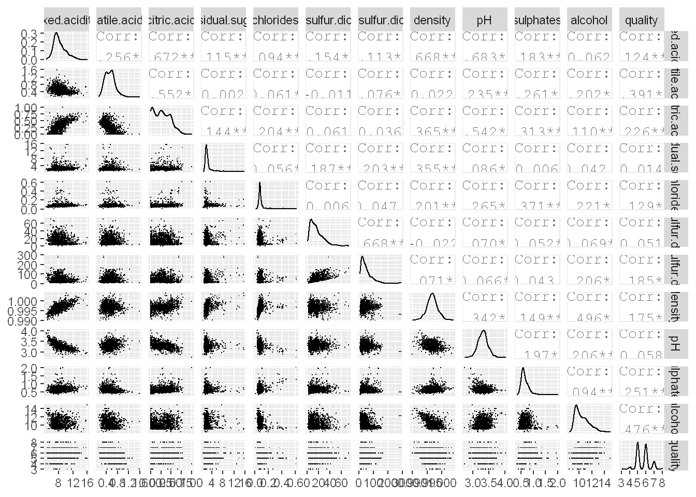
---

---
```
```Relative to quality, there appears to be a positive association with alcohol, and a negative association with density, chlorides, and volatile acidity.

```
---

---
``` Quality and Relationships with wine contents


```{r Density plots}

 ggplot(aes(x=alcohol),data = wineQualityReds) + 
  geom_density(aes(fill = I('#F79420')))+
  facet_wrap(~quality)+
   ggtitle('Alcohol and  Quality Relationship')
```
---

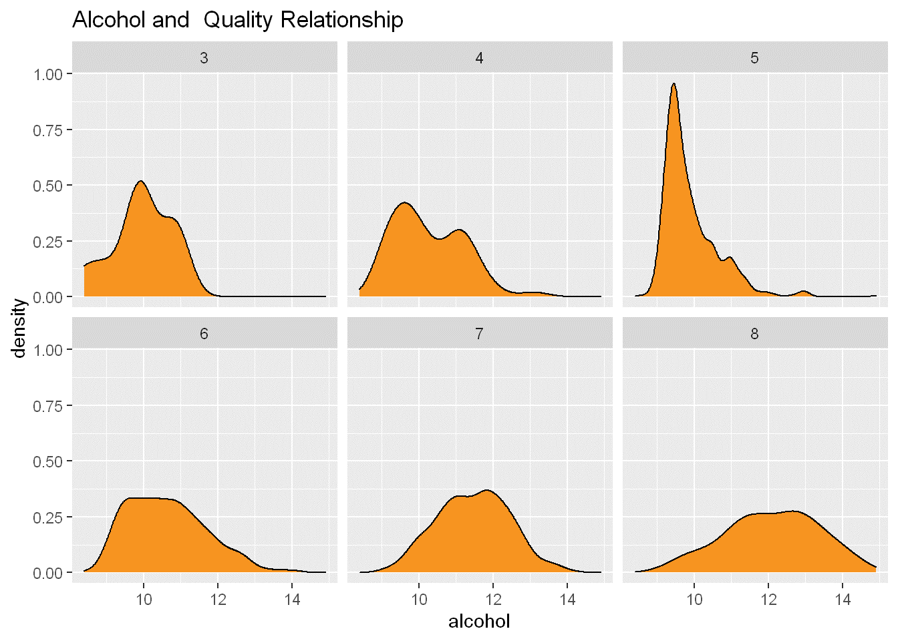

---
So far, there appears to be a relatively even distribution of alcohol with quality grading.

```

``` Distribution of Alcohol, pH, and SO2 (free and total) in the data set
Notes:

```{r alcohol and ph distribution}
plot1 <- qplot(data = wineQualityReds, x = alcohol, binwidth = 0.01, fill = I('#099DD9'))  + 
  ggtitle('Alcohol (log10)') + scale_x_log10()

plot2 <- qplot(data = wineQualityReds, x = pH, binwidth = .01, fill = I('#F79420')) +
  ggtitle('Ph (log10)') + scale_x_log10()

plot3 <- qplot(data = wineQualityReds, x = free.sulfur.dioxide, binwidth = .1, fill = I('#F79420')) +
  ggtitle('Free SO2 (log10)') + scale_x_log10()

plot4 <- qplot(data = wineQualityReds, x = total.sulfur.dioxide, binwidth = .1, fill = I('#F79420')) +
  ggtitle('Total SO2 (log10)') + scale_x_log10()

grid.arrange(plot1, plot2, plot3, plot4, ncol = 2)

```
---


---
Data set appears to present that there is a relatively even distribution of the major compnents in the data.
```

---
``` Scatterplots

```{r Scatterplots}
pp2 <-ggplot(aes(x = alcohol, y = quality), data = wineQualityReds) +
  geom_density(aes(color = 'orange'), stat = 'summary') + ggtitle('Alcohol and Quality') + coord_cartesian(ylim = c(3, 9))

pp3 <-ggplot(aes(x = pH, y = quality), data = wineQualityReds) +
  geom_density(aes(color = 'orange'), stat = 'summary') + ggtitle('Ph and Quality') + coord_cartesian(ylim = c(3, 9))

pp4 <-ggplot(aes(x = total.sulfur.dioxide, y = quality), data = wineQualityReds) +
  geom_density(aes(color = 'orange'), stat = 'summary') + ggtitle('Total SO2 and Quality') + coord_cartesian(ylim = c(3, 9))

pp5 <-ggplot(aes(x = sulphates, y = quality), data = wineQualityReds) +
  geom_density(aes(color = 'orange'), stat = 'summary') + ggtitle('Sulphates and Quality') + coord_cartesian(ylim = c(3, 9))

grid.arrange(pp2, pp3, pp4, pp5, ncol = 2)

```
---

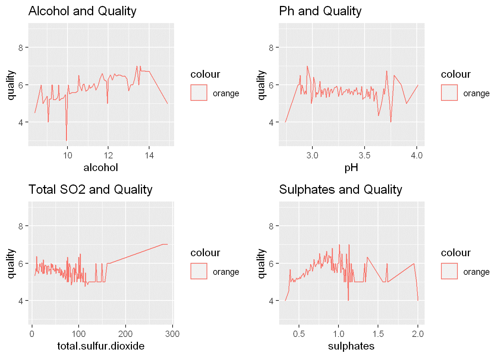
---

---
'''
''' At closer glance, there is a slight association with alcohol and quality. Quality also appears to be impacted by SO2 and Sulphates at the extreme ends. However, the individual compenents within avarage quantities don't appear to have a direct impact on quality except for alcohol.

'''
---

---
'''Linear Models in R
---

''' Building the Linear Model
```{r Wine quality linear model}

winequality <- lm(quality ~ fixed.acidity + volatile.acidity + citric.acid + residual.sugar + chlorides + free.sulfur.dioxide + total.sulfur.dioxide + density + pH + sulphates + alcohol, data = wineQualityReds)

summary(winequality)

confint(winequality, conf.level=0.95)

plot(winequality)
```
---
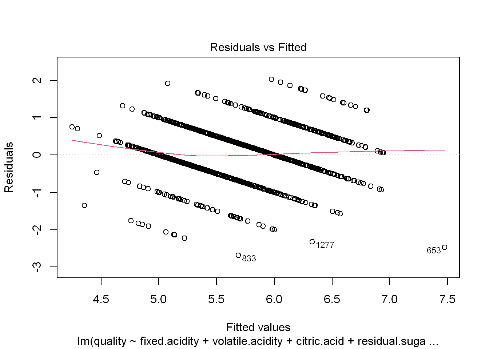
---
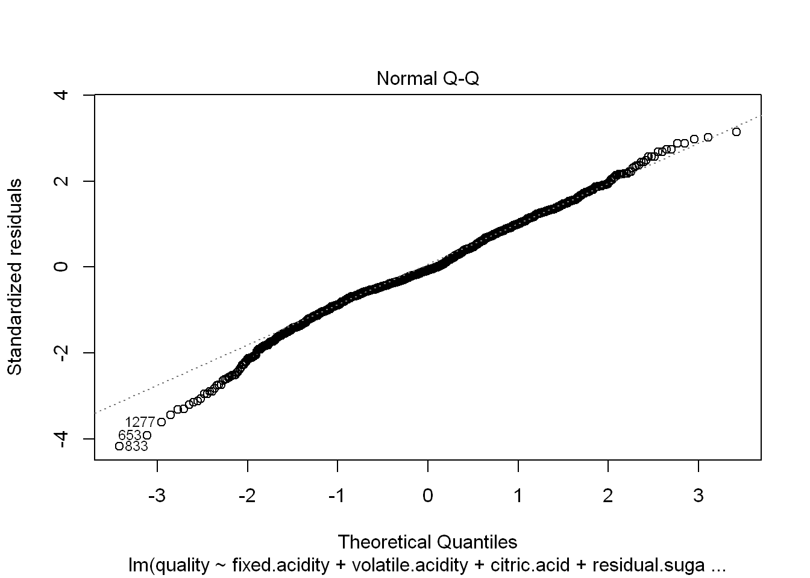
---
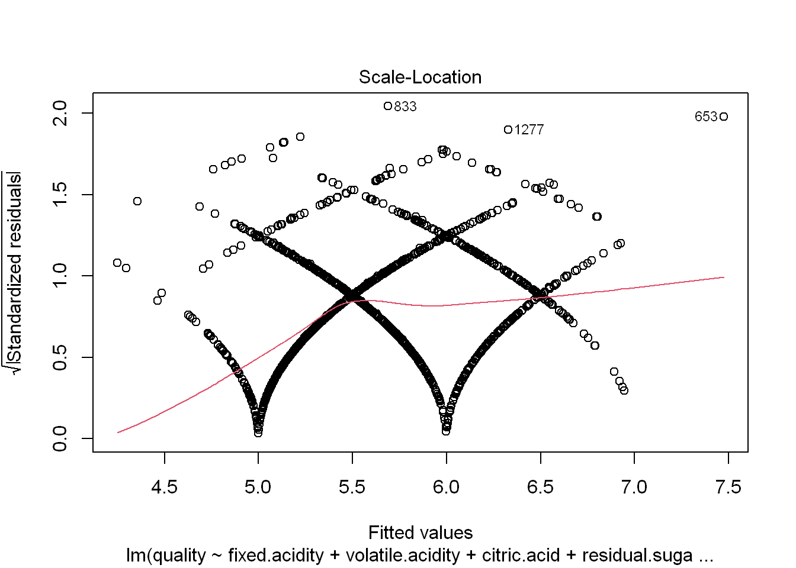
---
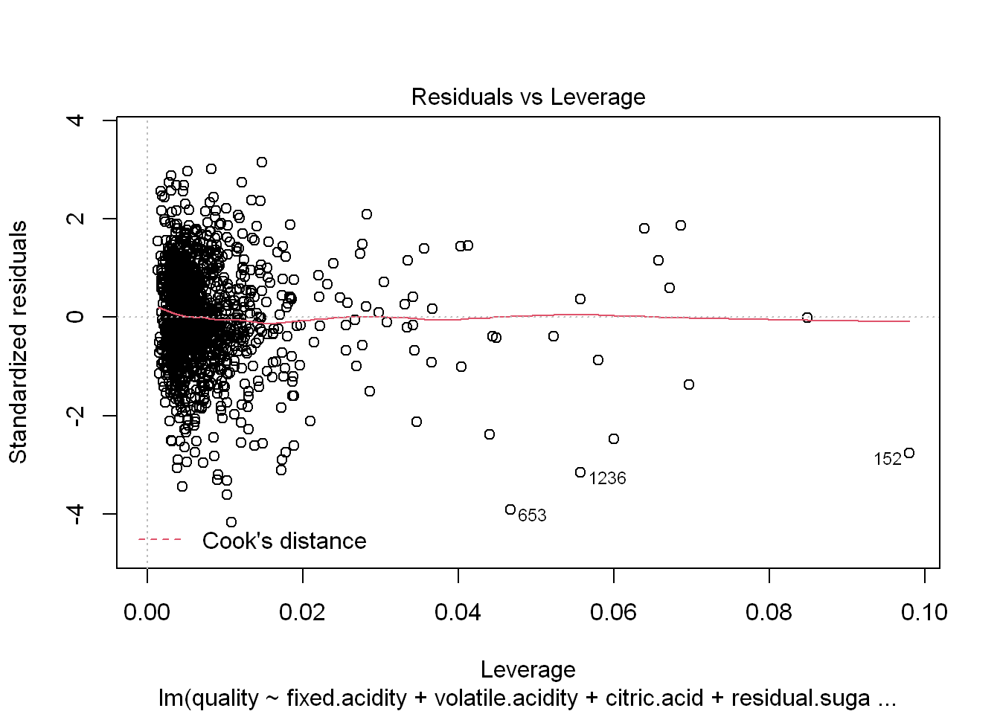
---

---
''' Model Final Thoughts
---
Model shows some significance with alcohol, sulphates, total.sulfur.dioxide, chlorides, and volatile.acidity. Some minor significance with pH and free.sulfur.dioxide.


Further Research considerations:
The model appears to show some minor association with the contents of the wine adding to its quality.
However, the R2 of the model is only 0.36. This leads me to believe that much more would need to be done. Wine experts usually associate wine quality with the balance of sweetness, acidity, tannin, and alcohol in the wine. The wine quality data set doesn't account for regional variations or grape variations (pinot vs malbec, as an example). It also doesn't account for the wine storage or the age of the wine.


```
---

---
'''A second look at the model with reduced variables.

''' Building the Linear Model
```{r Wine quality linear model with reduced variables}

winequality <- lm(quality ~ volatile.acidity + chlorides + total.sulfur.dioxide + pH + sulphates + alcohol, data = wineQualityReds)

summary(winequality)

confint(winequality, conf.level=0.95)

plot(winequality)
```
---
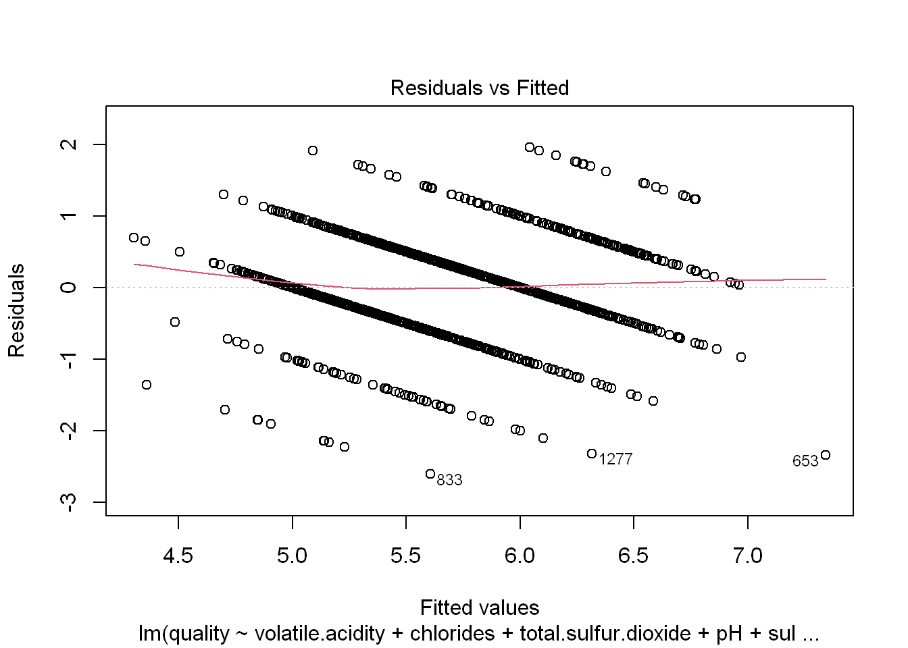
---
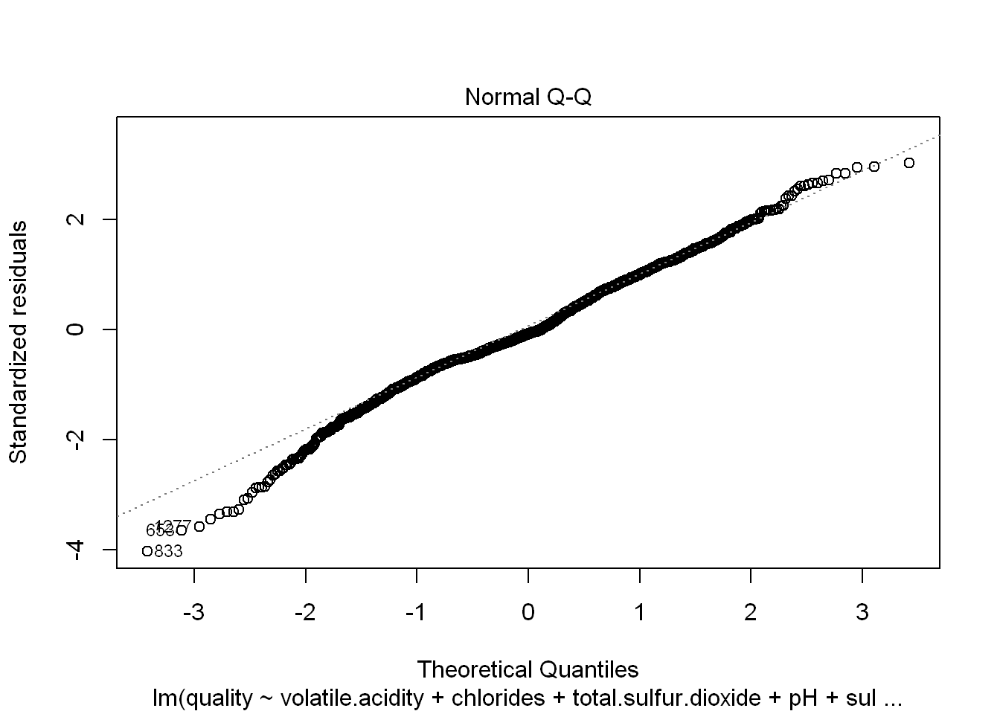
---
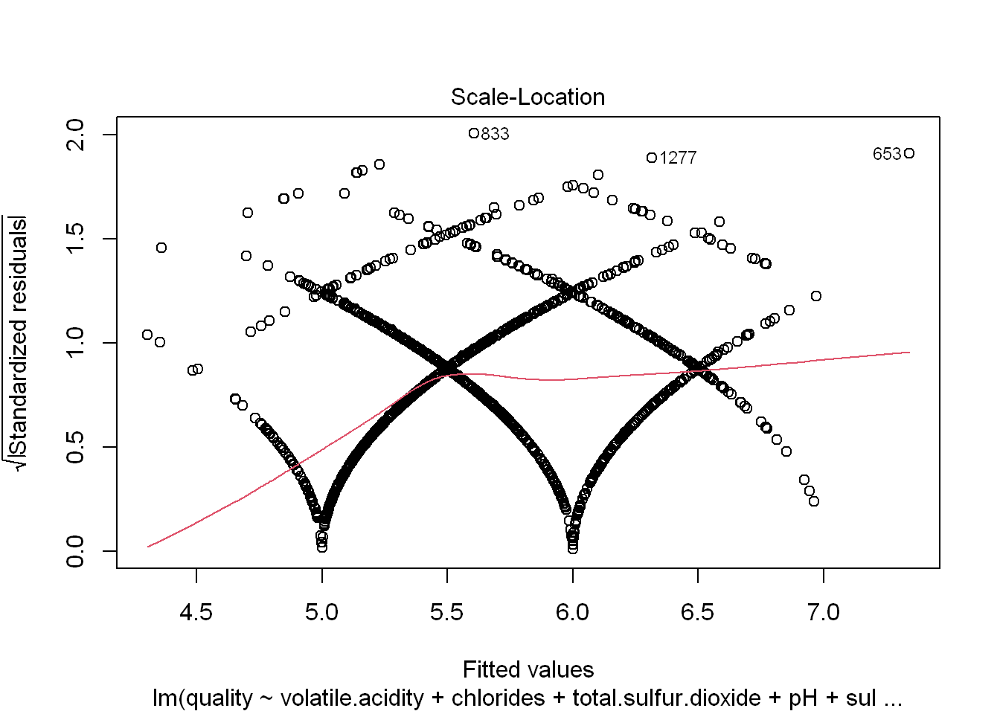
---
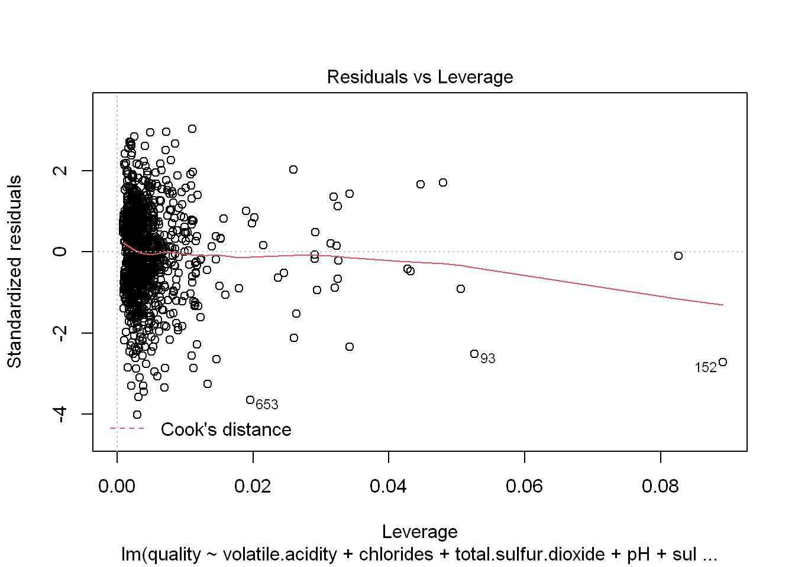
---


---
''' A simpler model with just the significant variables. However, R2 hasn't improved very much at just 0.3572
---

```{r evaluating the simple model}

'''A look at the slim model and prediction

'''Using some random variable figures for a bottle of wine
thiswinebottle = data.frame(volatile.acidity = 0.80, chlorides = 0.5,
                         total.sulfur.dioxide = 90, pH=3.0, sulphates=0.999, alcohol=12)

modelEstimate = predict(winequality, newdata = thiswinebottle,
                        interval="prediction", level = .95)

modelEstimate

exp(modelEstimate)


```
---


---
```{r effect plot of simple model}

```Plot of effect on quality model with change in alcohol

effect_plot(model = winequality, pred = alcohol, interval = TRUE, plot.points = TRUE)
```
---

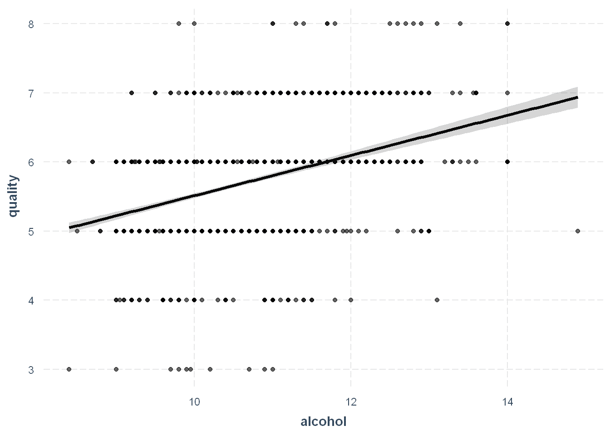

---

---
```{r simple model residuals}
```plot of the residuals with a change in alcohol

dat = data.frame(winequality$model, winequality$residuals)

with(dat, sd(winequality.residuals))

with(subset(dat, alcohol > 8 & alcohol < 15), sd(winequality.residuals))

dat$resid <- as.numeric(dat$winequality.residuals)

ggplot(aes(y = resid, x = round(alcohol, 2)), data = dat) +
  geom_line(stat = "summary", fun.y = sd)


```
---


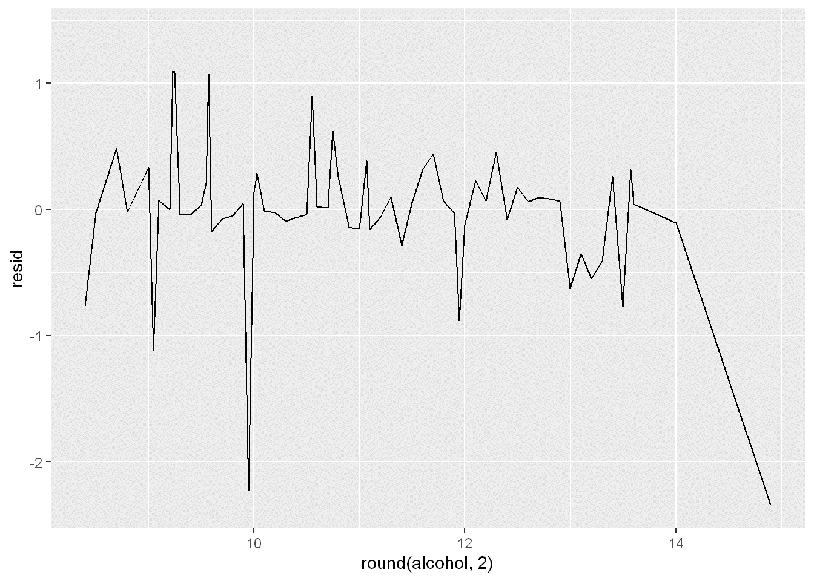


---

```
Final analysis of the mini version of the model does show some capability of estimating
wine quality given a narrow range of inputs. It would be interesting to test the predictability against a set of real world wine bottles and see if the model is worthy
of predicting wine quality outcomes.

```