# Final Project - Wine Quality Reds

### Welcome

Exploration of the Wine data set focusing on Reds.

Notes on wine production: The quality of grape vines and the soil play a huge part in wine quality. The &quot;terroir,&quot; is how a region&#39;s climate and soils affect the taste of wine. Wine production goes through a series of steps that include: Harvest of the grapes Transportation/Cooling/Handling De-Stemming/Crushing Additions/Adjustments (Sulfurdioxide, Sugar, Acids) These adjustments can impact the fine quality of the wine. Fermentation using yeast with the skins on Draining/Pressing Malo-lactic fermentation. Then racking/clarification and storage. Possible blending with other wines. Clarification/Fining. Cold stabilization.

The timing and picking of the grapes greatly affects the quality of the wine.

The taste and &#39;mouth-feel&#39; sensations are due to the included compounds - ethanol, acids(malic, lactic, and tartaric), sugars, and glycerol.

How a wine is stored can also impact its quality. Oak barrels impart various compounds and flavors to the wine, while stainless steel does not.

###Load libraries

library(dplyr)

##

## Attaching package: &#39;dplyr&#39;

## The following objects are masked from &#39;package:stats&#39;:

##

## filter, lag

## The following objects are masked from &#39;package:base&#39;:

##

## intersect, setdiff, setequal, union

library(ggplot2)

library(gridExtra)

##

## Attaching package: &#39;gridExtra&#39;

## The following object is masked from &#39;package:dplyr&#39;:

##

## combine

library(grid)

library(lattice)

library(ggplot2)

library(GGally)

## Warning: package &#39;GGally&#39; was built under R version 4.0.2

## Registered S3 method overwritten by &#39;GGally&#39;:

## method from

## +.gg ggplot2

library(scales)

library(memisc)

## Warning: package &#39;memisc&#39; was built under R version 4.0.2

## Loading required package: MASS

## Warning: package &#39;MASS&#39; was built under R version 4.0.2

##

## Attaching package: &#39;MASS&#39;

## The following object is masked from &#39;package:dplyr&#39;:

##

## select

##

## Attaching package: &#39;memisc&#39;

## The following object is masked from &#39;package:scales&#39;:

##

## percent

## The following object is masked from &#39;package:ggplot2&#39;:

##

## syms

## The following objects are masked from &#39;package:dplyr&#39;:

##

## collect, recode, rename, syms

## The following objects are masked from &#39;package:stats&#39;:

##

## contr.sum, contr.treatment, contrasts

## The following object is masked from &#39;package:base&#39;:

##

## as.array

library(RColorBrewer)

library(bitops)

library(RCurl)

library(jtools)

## Warning: package &#39;jtools&#39; was built under R version 4.0.2

##

## Attaching package: &#39;jtools&#39;

## The following object is masked from &#39;package:memisc&#39;:

##

## %nin%

###Load Wine Data Set

wineQualityReds \&lt;- read.csv(&#39;wineQualityReds.csv&#39;)

### 1599 obs. of 13 variables

###Initial Examination of the data set

summary(wineQualityReds)

## X fixed.acidity volatile.acidity citric.acid

## Min. : 1.0 Min. : 4.60 Min. :0.1200 Min. :0.000

## 1st Qu.: 400.5 1st Qu.: 7.10 1st Qu.:0.3900 1st Qu.:0.090

## Median : 800.0 Median : 7.90 Median :0.5200 Median :0.260

## Mean : 800.0 Mean : 8.32 Mean :0.5278 Mean :0.271

## 3rd Qu.:1199.5 3rd Qu.: 9.20 3rd Qu.:0.6400 3rd Qu.:0.420

## Max. :1599.0 Max. :15.90 Max. :1.5800 Max. :1.000

## residual.sugar chlorides free.sulfur.dioxide total.sulfur.dioxide

## Min. : 0.900 Min. :0.01200 Min. : 1.00 Min. : 6.00

## 1st Qu.: 1.900 1st Qu.:0.07000 1st Qu.: 7.00 1st Qu.: 22.00

## Median : 2.200 Median :0.07900 Median :14.00 Median : 38.00

## Mean : 2.539 Mean :0.08747 Mean :15.87 Mean : 46.47

## 3rd Qu.: 2.600 3rd Qu.:0.09000 3rd Qu.:21.00 3rd Qu.: 62.00

## Max. :15.500 Max. :0.61100 Max. :72.00 Max. :289.00

## density pH sulphates alcohol

## Min. :0.9901 Min. :2.740 Min. :0.3300 Min. : 8.40

## 1st Qu.:0.9956 1st Qu.:3.210 1st Qu.:0.5500 1st Qu.: 9.50

## Median :0.9968 Median :3.310 Median :0.6200 Median :10.20

## Mean :0.9967 Mean :3.311 Mean :0.6581 Mean :10.42

## 3rd Qu.:0.9978 3rd Qu.:3.400 3rd Qu.:0.7300 3rd Qu.:11.10

## Max. :1.0037 Max. :4.010 Max. :2.0000 Max. :14.90

## quality

## Min. :3.000

## 1st Qu.:5.000

## Median :6.000

## Mean :5.636

## 3rd Qu.:6.000

## Max. :8.000

Quick Summary Notes:

There is a big range for sulfur.dioxide (both Free and Total) across the samples. The sample consists of 1599 Red Wine with 13 variables (the first being an index count). The alcohol content varies from 8.4 to 14.90 for the samples in data set. The quality of the samples range from 3 to 8 with 6 being the median, 5.636 the mean. The range for fixed acidity is quite high with minimum being 4.6 and maximum being 15.9, pH value varies from 2.74 to 4.010 with a median being 3.311.

###GGPairs output to explore correlations between the variables and quality

# Data set is only 1599 observations, so will not sample here.

#remove first column, which is just an index

wineQualityReds$X \&lt;- NULL

names(wineQualityReds)

## [1] &quot;fixed.acidity&quot; &quot;volatile.acidity&quot; &quot;citric.acid&quot;

## [4] &quot;residual.sugar&quot; &quot;chlorides&quot; &quot;free.sulfur.dioxide&quot;

## [7] &quot;total.sulfur.dioxide&quot; &quot;density&quot; &quot;pH&quot;

## [10] &quot;sulphates&quot; &quot;alcohol&quot; &quot;quality&quot;

ggpairs(wineQualityReds,

lower = list(continuous = wrap(&quot;points&quot;, shape = I(&#39;.&#39;))),

upper = list(combo = wrap(&quot;box&quot;, outlier.shape = I(&#39;.&#39;))))

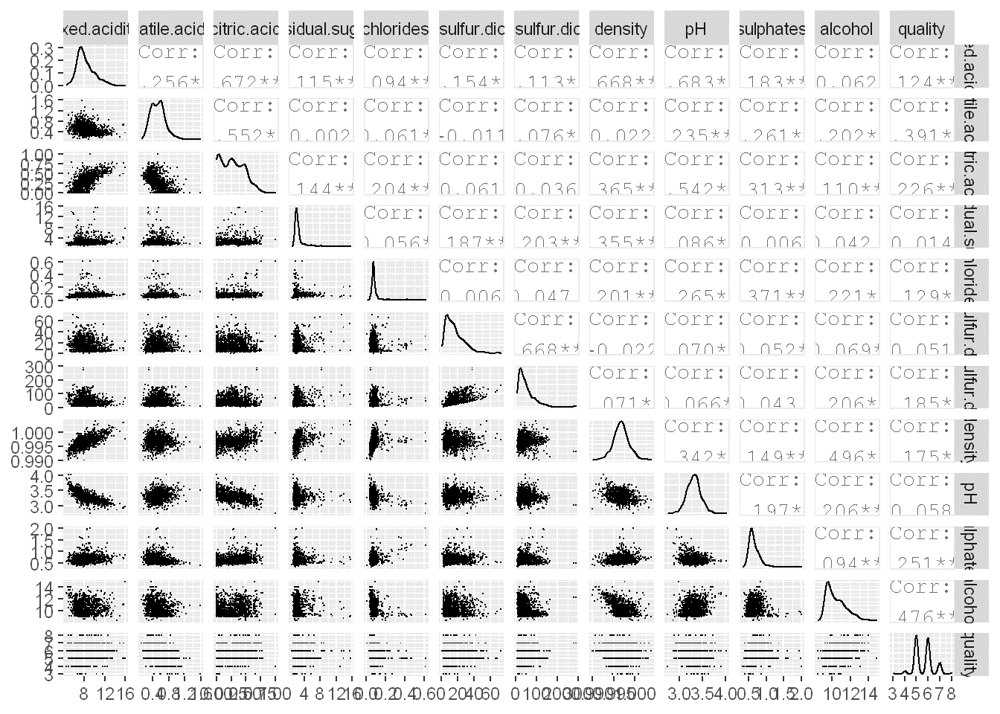

### Relative to quality, there appears to be a positive association with alcohol, and a negative association with density, chlorides, and volatile acidity.

### Quality and Relationships with wine contents

ggplot(aes(x=alcohol),data = wineQualityReds) +

geom\_density(aes(fill = I(&#39;#F79420&#39;)))+

facet\_wrap(~quality)+

ggtitle(&#39;Alcohol and Quality Relationship&#39;)

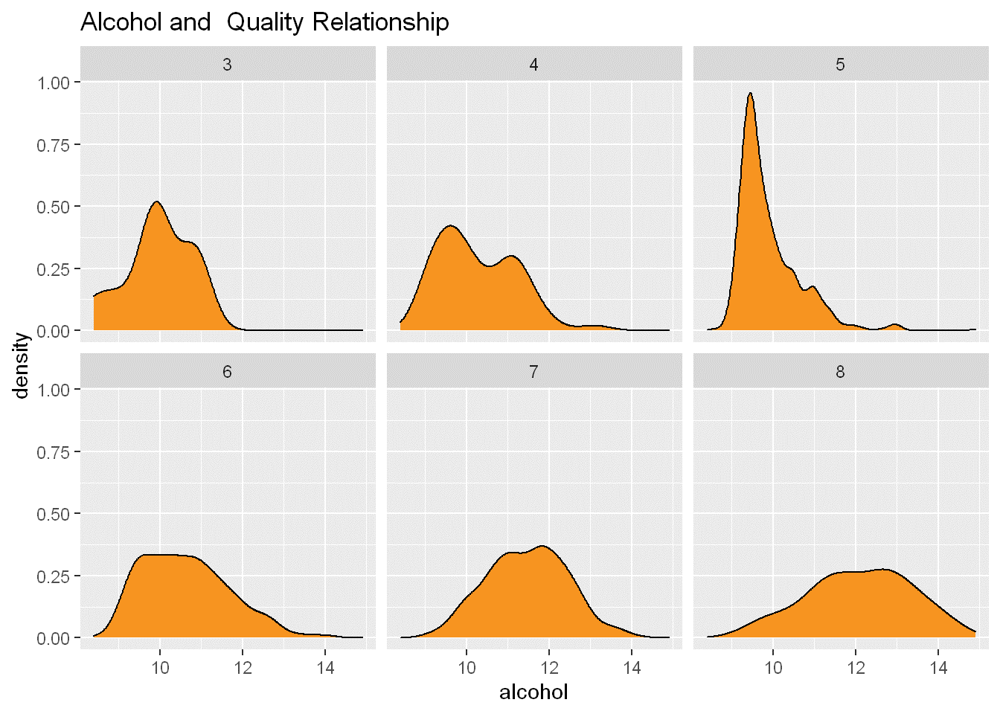

So far, there appears to be a relatively even distribution of alcohol with quality grading.

### Distribution of Alcohol, pH, and SO2 (free and total) in the data set

Notes:

plot1 \&lt;- qplot(data = wineQualityReds, x = alcohol, binwidth = 0.01, fill = I(&#39;#099DD9&#39;)) +

ggtitle(&#39;Alcohol (log10)&#39;) + scale\_x\_log10()

plot2 \&lt;- qplot(data = wineQualityReds, x = pH, binwidth = .01, fill = I(&#39;#F79420&#39;)) +

ggtitle(&#39;Ph (log10)&#39;) + scale\_x\_log10()

plot3 \&lt;- qplot(data = wineQualityReds, x = free.sulfur.dioxide, binwidth = .1, fill = I(&#39;#F79420&#39;)) +

ggtitle(&#39;Free SO2 (log10)&#39;) + scale\_x\_log10()

plot4 \&lt;- qplot(data = wineQualityReds, x = total.sulfur.dioxide, binwidth = .1, fill = I(&#39;#F79420&#39;)) +

ggtitle(&#39;Total SO2 (log10)&#39;) + scale\_x\_log10()

grid.arrange(plot1, plot2, plot3, plot4, ncol = 2)

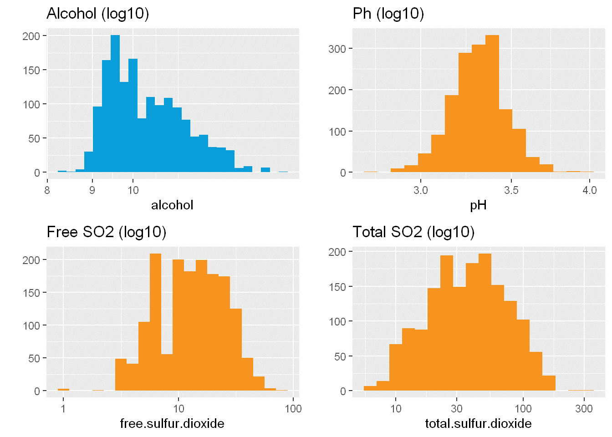

Data set appears to present that there is a relatively even distribution of the major compnents in the data. \*\*\*

### Scatterplots

pp2 \&lt;-ggplot(aes(x = alcohol, y = quality), data = wineQualityReds) +

geom\_density(aes(color = &#39;orange&#39;), stat = &#39;summary&#39;) + ggtitle(&#39;Alcohol and Quality&#39;) + coord\_cartesian(ylim = c(3, 9))

pp3 \&lt;-ggplot(aes(x = pH, y = quality), data = wineQualityReds) +

geom\_density(aes(color = &#39;orange&#39;), stat = &#39;summary&#39;) + ggtitle(&#39;Ph and Quality&#39;) + coord\_cartesian(ylim = c(3, 9))

pp4 \&lt;-ggplot(aes(x = total.sulfur.dioxide, y = quality), data = wineQualityReds) +

geom\_density(aes(color = &#39;orange&#39;), stat = &#39;summary&#39;) + ggtitle(&#39;Total SO2 and Quality&#39;) + coord\_cartesian(ylim = c(3, 9))

pp5 \&lt;-ggplot(aes(x = sulphates, y = quality), data = wineQualityReds) +

geom\_density(aes(color = &#39;orange&#39;), stat = &#39;summary&#39;) + ggtitle(&#39;Sulphates and Quality&#39;) + coord\_cartesian(ylim = c(3, 9))

grid.arrange(pp2, pp3, pp4, pp5, ncol = 2)

## No summary function supplied, defaulting to `mean_se()`

## No summary function supplied, defaulting to `mean_se()`

## No summary function supplied, defaulting to `mean_se()`

## No summary function supplied, defaulting to `mean_se()`

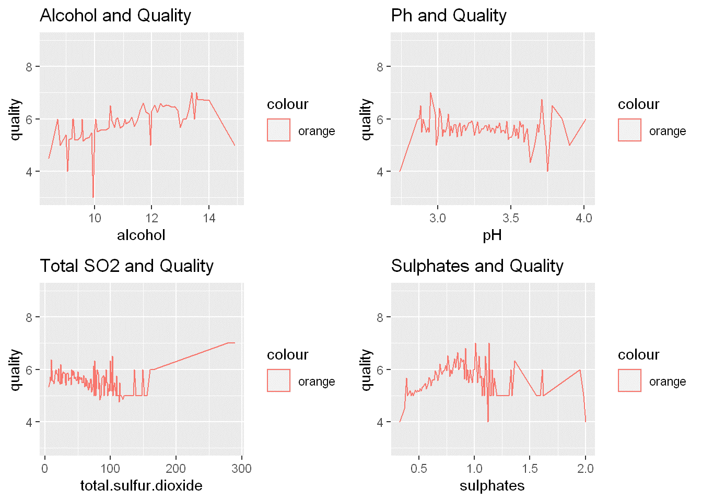

### At closer glance, there is a slight association with alcohol and quality. Quality also appears to be impacted by SO2 and Sulphates at the extreme ends. However, the individual compenents within avarage quantities don&#39;t appear to have a direct impact on quality except for alcohol.

### Linear Models in R

### Building the Linear Model

winequality \&lt;- lm(quality ~ fixed.acidity + volatile.acidity + citric.acid + residual.sugar + chlorides + free.sulfur.dioxide + total.sulfur.dioxide + density + pH + sulphates + alcohol, data = wineQualityReds)

summary(winequality)

##

## Call:

## lm(formula = quality ~ fixed.acidity + volatile.acidity + citric.acid +

## residual.sugar + chlorides + free.sulfur.dioxide + total.sulfur.dioxide +

## density + pH + sulphates + alcohol, data = wineQualityReds)

##

## Residuals:

## Min 1Q Median 3Q Max

## -2.68911 -0.36652 -0.04699 0.45202 2.02498

##

## Coefficients:

## Estimate Std. Error t value Pr(\&gt;|t|)

## (Intercept) 2.197e+01 2.119e+01 1.036 0.3002

## fixed.acidity 2.499e-02 2.595e-02 0.963 0.3357

## volatile.acidity -1.084e+00 1.211e-01 -8.948 \&lt; 2e-16 \*\*\*

## citric.acid -1.826e-01 1.472e-01 -1.240 0.2150

## residual.sugar 1.633e-02 1.500e-02 1.089 0.2765

## chlorides -1.874e+00 4.193e-01 -4.470 8.37e-06 \*\*\*

## free.sulfur.dioxide 4.361e-03 2.171e-03 2.009 0.0447 \*

## total.sulfur.dioxide -3.265e-03 7.287e-04 -4.480 8.00e-06 \*\*\*

## density -1.788e+01 2.163e+01 -0.827 0.4086

## pH -4.137e-01 1.916e-01 -2.159 0.0310 \*

## sulphates 9.163e-01 1.143e-01 8.014 2.13e-15 \*\*\*

## alcohol 2.762e-01 2.648e-02 10.429 \&lt; 2e-16 \*\*\*

## ---

## Signif. codes: 0 &#39;\*\*\*&#39; 0.001 &#39;\*\*&#39; 0.01 &#39;\*&#39; 0.05 &#39;.&#39; 0.1 &#39; &#39; 1

##

## Residual standard error: 0.648 on 1587 degrees of freedom

## Multiple R-squared: 0.3606, Adjusted R-squared: 0.3561

## F-statistic: 81.35 on 11 and 1587 DF, p-value: \&lt; 2.2e-16

confint(winequality, conf.level=0.95)

## 2.5 % 97.5 %

## (Intercept) -1.960710e+01 63.537517843

## fixed.acidity -2.590639e-02 0.075887499

## volatile.acidity -1.321126e+00 -0.846054953

## citric.acid -4.712441e-01 0.106116245

## residual.sugar -1.309474e-02 0.045757280

## chlorides -2.696632e+00 -1.051817956

## free.sulfur.dioxide 1.024314e-04 0.008620235

## total.sulfur.dioxide -4.693951e-03 -0.001835208

## density -6.031362e+01 24.551294542

## pH -7.894637e-01 -0.037842600

## sulphates 6.920661e-01 1.140602768

## alcohol 2.242512e-01 0.328144192

plot(winequality)

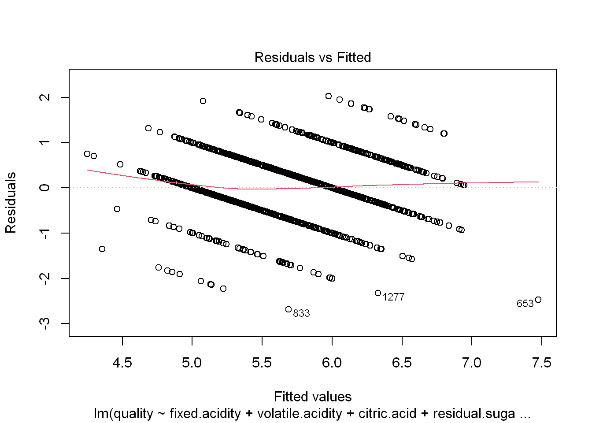

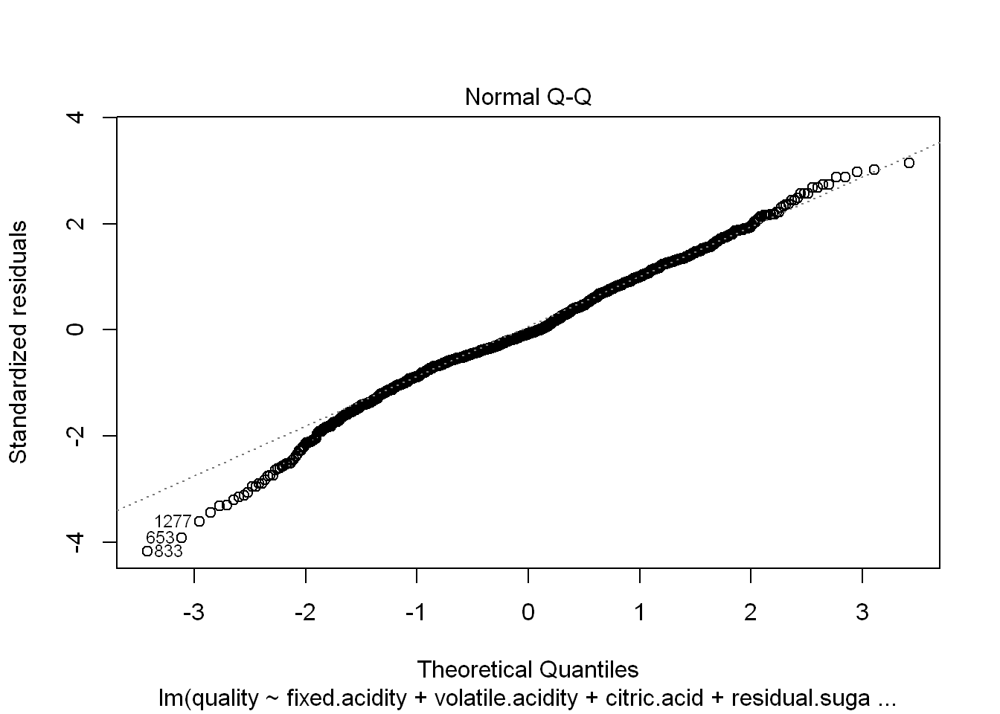

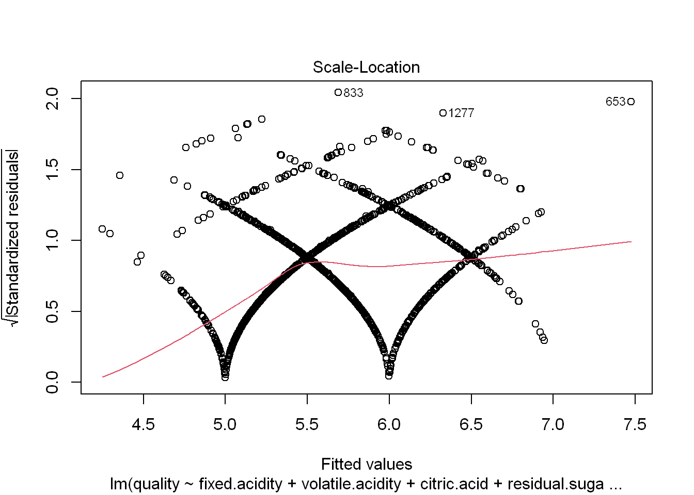

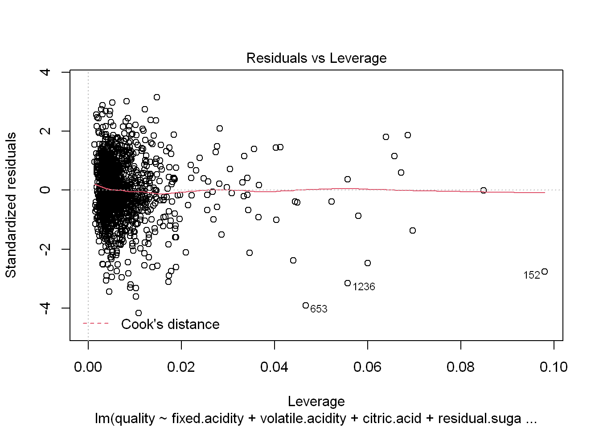

### Model Final Thoughts

Model shows some significance with alcohol, sulphates, total.sulfur.dioxide, chlorides, and volatile.acidity. Some minor significance with pH and free.sulfur.dioxide.

Further Research considerations: The model appears to show some minor association with the contents of the wine adding to its quality. However, the R2 of the model is only 0.36. This leads me to believe that much more would need to be done. Wine experts usually associate wine quality with the balance of sweetness, acidity, tannin, and alcohol in the wine. The wine quality data set doesn&#39;t account for regional variations or grape variations (pinot vs malbec, as an example). It also doesn&#39;t account for the wine storage or the age of the wine.

###A second look at the model with reduced variables.

### Building the Linear Model

winequality \&lt;- lm(quality ~ volatile.acidity + chlorides + total.sulfur.dioxide + pH + sulphates + alcohol, data = wineQualityReds)

summary(winequality)

##

## Call:

## lm(formula = quality ~ volatile.acidity + chlorides + total.sulfur.dioxide +

## pH + sulphates + alcohol, data = wineQualityReds)

##

## Residuals:

## Min 1Q Median 3Q Max

## -2.60575 -0.35883 -0.04806 0.46079 1.95643

##

## Coefficients:

## Estimate Std. Error t value Pr(\&gt;|t|)

## (Intercept) 4.2957316 0.3995603 10.751 \&lt; 2e-16 \*\*\*

## volatile.acidity -1.0381945 0.1004270 -10.338 \&lt; 2e-16 \*\*\*

## chlorides -2.0022839 0.3980757 -5.030 5.46e-07 \*\*\*

## total.sulfur.dioxide -0.0023721 0.0005064 -4.684 3.05e-06 \*\*\*

## pH -0.4351830 0.1160368 -3.750 0.000183 \*\*\*

## sulphates 0.8886802 0.1100419 8.076 1.31e-15 \*\*\*

## alcohol 0.2906738 0.0168108 17.291 \&lt; 2e-16 \*\*\*

## ---

## Signif. codes: 0 &#39;\*\*\*&#39; 0.001 &#39;\*\*&#39; 0.01 &#39;\*&#39; 0.05 &#39;.&#39; 0.1 &#39; &#39; 1

##

## Residual standard error: 0.6487 on 1592 degrees of freedom

## Multiple R-squared: 0.3572, Adjusted R-squared: 0.3548

## F-statistic: 147.4 on 6 and 1592 DF, p-value: \&lt; 2.2e-16

confint(winequality, conf.level=0.95)

## 2.5 % 97.5 %

## (Intercept) 3.512011865 5.079451267

## volatile.acidity -1.235177646 -0.841211392

## chlorides -2.783091418 -1.221476293

## total.sulfur.dioxide -0.003365439 -0.001378819

## pH -0.662783952 -0.207582077

## sulphates 0.672837922 1.104522390

## alcohol 0.257700230 0.323647379

plot(winequality)

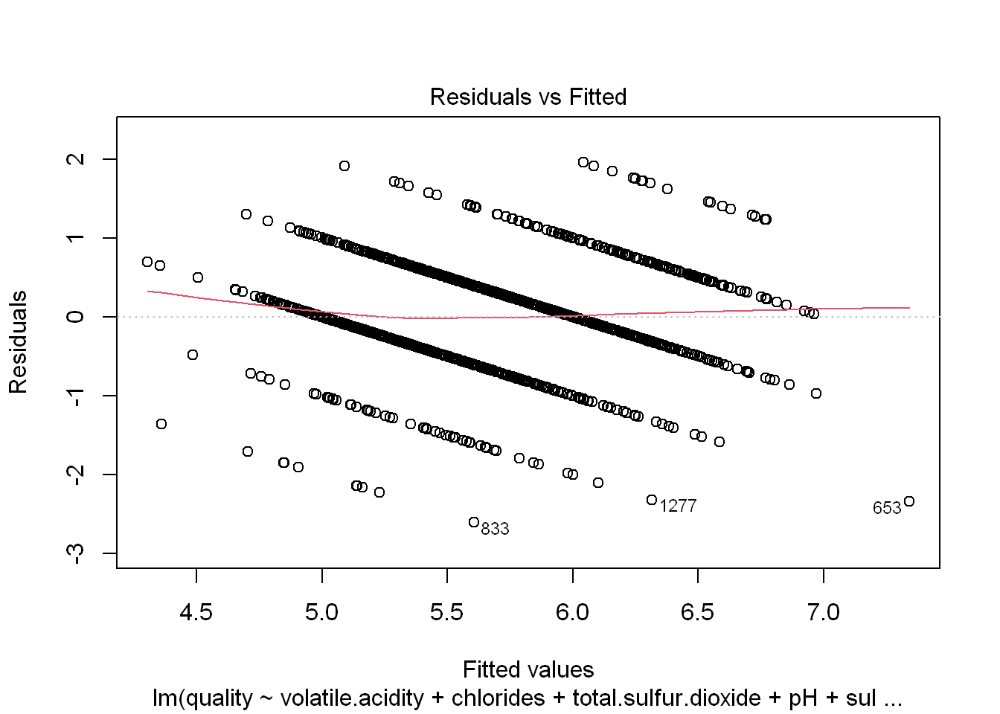

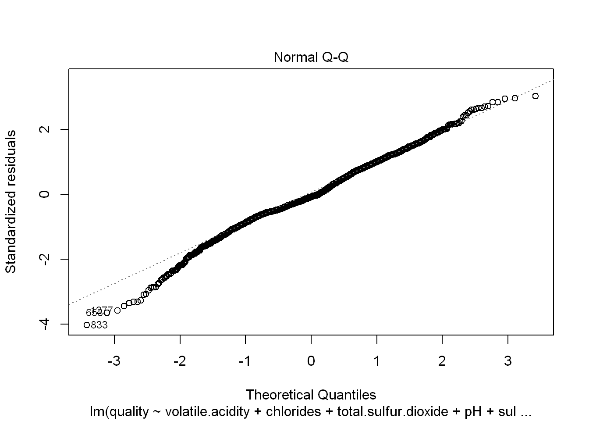

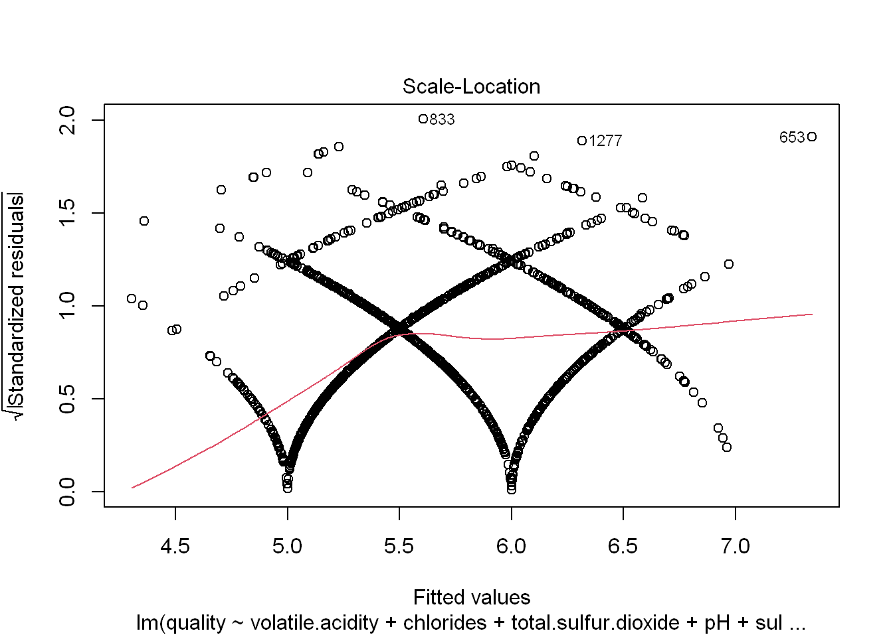

### A simpler model with just the significant variables. However, R2 hasn&#39;t improved very much at just 0.3572

###A look at the slim model and prediction

###Using some random variable figures for a bottle of wine

thiswinebottle = data.frame(volatile.acidity = 0.80, chlorides = 0.5,

total.sulfur.dioxide = 90, pH=3.0, sulphates=0.999, alcohol=12)

modelEstimate = predict(winequality, newdata = thiswinebottle,

interval=&quot;prediction&quot;, level = .95)

modelEstimate

## fit lwr upr

## 1 5.320871 4.009506 6.632235

exp(modelEstimate)

## fit lwr upr

## 1 204.5619 55.11961 759.1774

#Plot of effect on quality model with change in alcohol

effect\_plot(model = winequality, pred = alcohol, interval = TRUE, plot.points = TRUE)

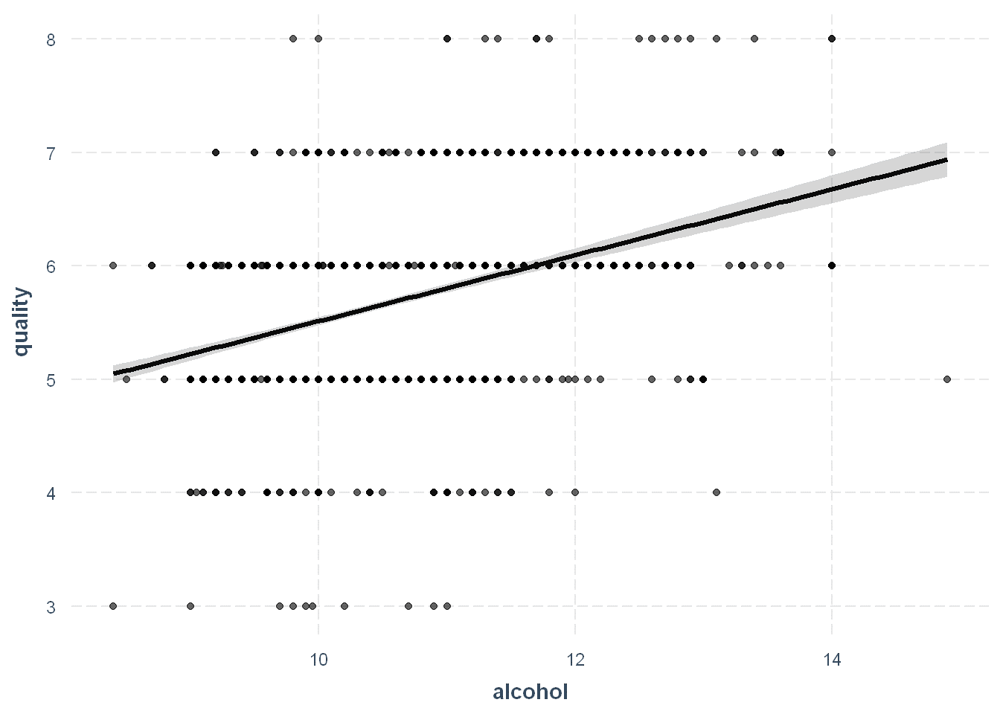

#plot of the residuals with a change in alcohol

dat = data.frame(winequality$model, winequality$residuals)

with(dat, sd(winequality.residuals))

## [1] 0.6474805

with(subset(dat, alcohol \&gt; 8 &amp; alcohol \&lt; 15), sd(winequality.residuals))

## [1] 0.6474805

dat$resid \&lt;- as.numeric(dat$winequality.residuals)

ggplot(aes(y = resid, x = round(alcohol, 2)), data = dat) +

geom\_line(stat = &quot;summary&quot;, fun.y = sd)

## Warning: Ignoring unknown parameters: fun.y

## No summary function supplied, defaulting to `mean_se()`

\*\*\*

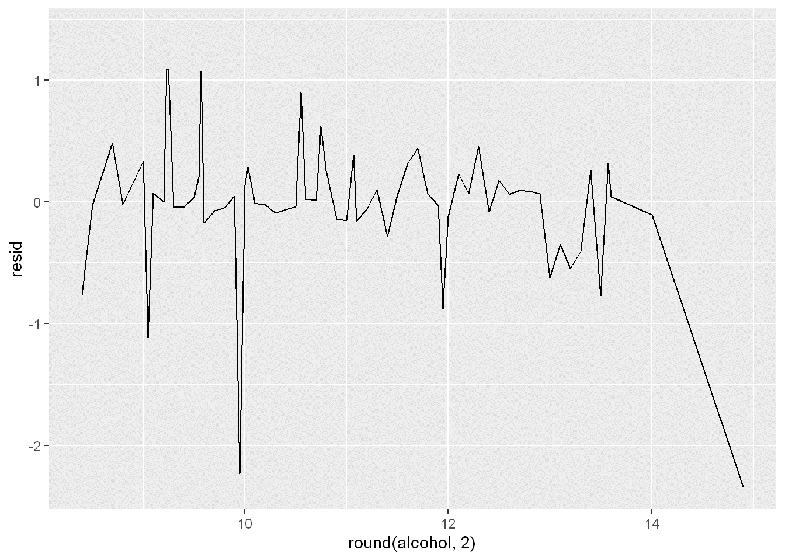

Final analysis of the mini version of the model does show some capability of estimating wine quality given a narrow range of inputs. It would be interesting to test the predictability against a set of real world wine bottles and see if the model is worthy of predicting wine quality outcomes.